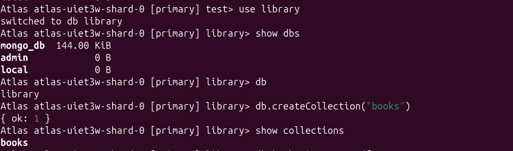
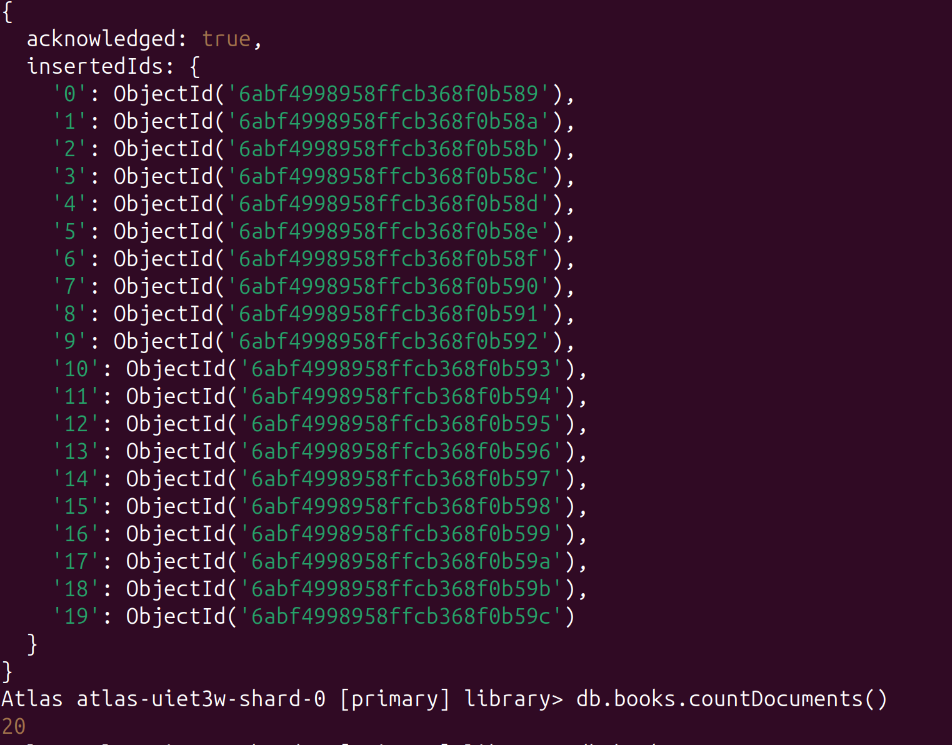
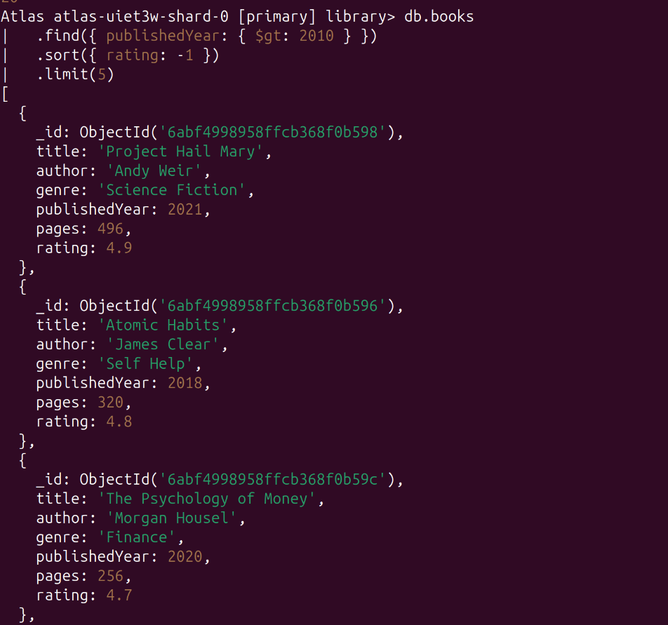
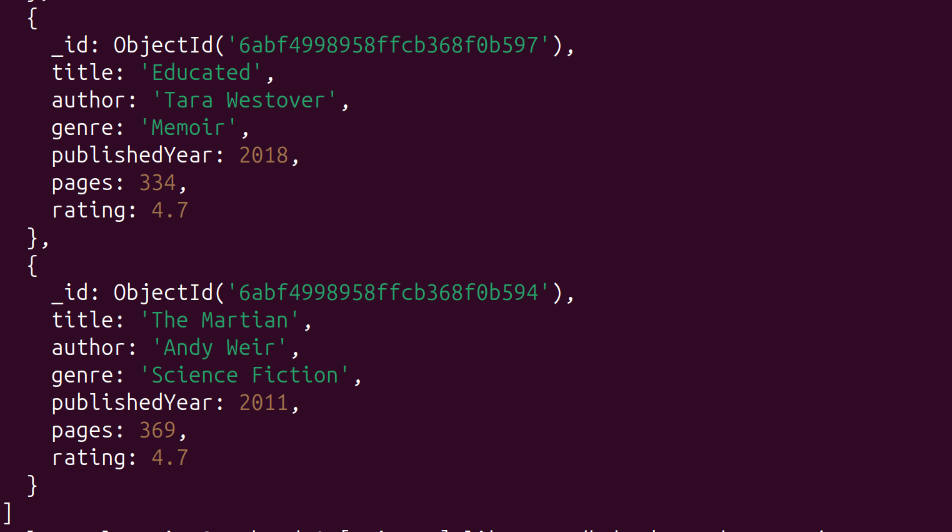
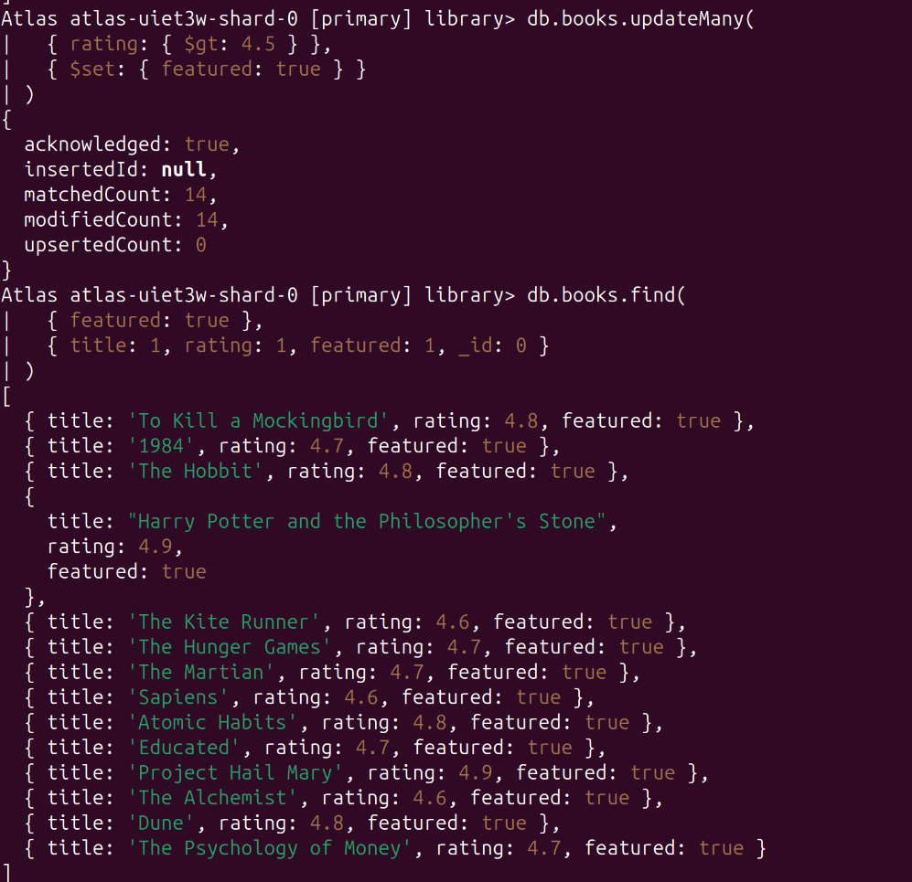
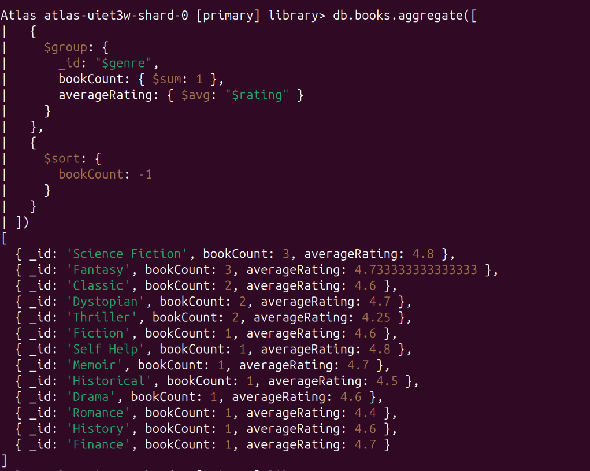
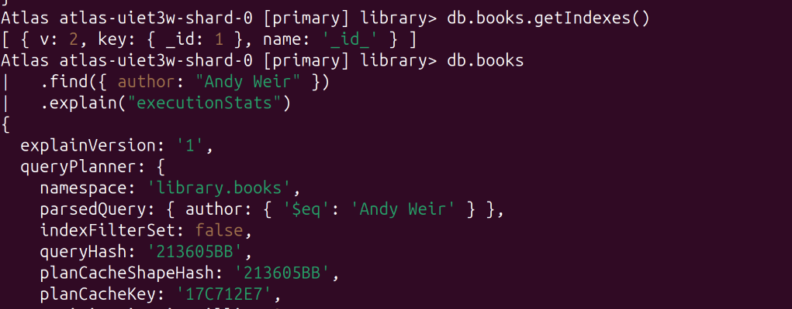
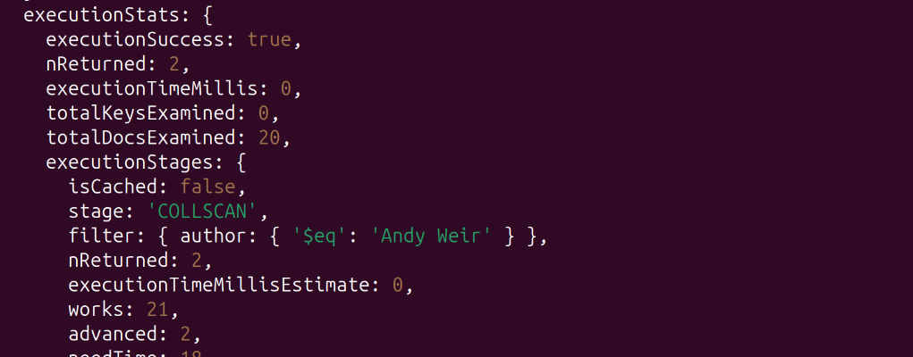
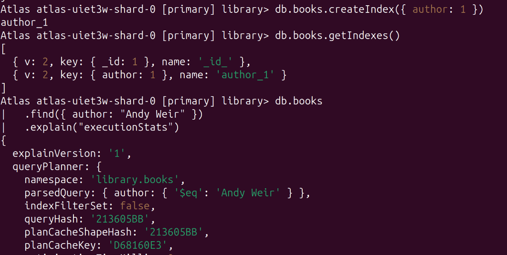
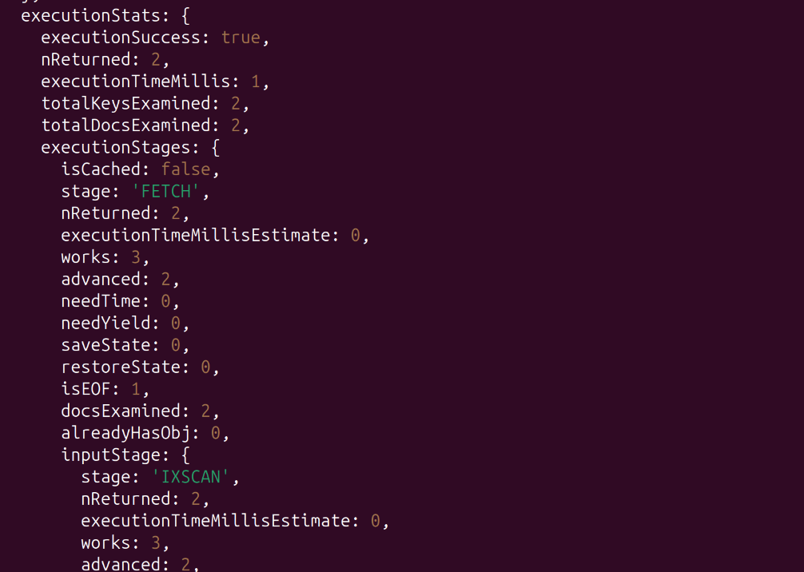

# MongoDB Library CRUD Exercise

## Database Setup

### Create database

use library

db.createCollection("books")

------------------------------------------------

db.books.insertMany([
  // 20 book documents
])

db.books.countDocuments()

---------------------------------------------------------

Find all books published after 2010, sorted by rating desc, limit 5.

db.books
  .find({ publishedYear: { $gt: 2010 } })
  .sort({ rating: -1 })
  .limit(5)

-----------------------------------------------------------------

Update all books with rating > 4.5 to add a field featured: true.

db.books.updateMany(
  { rating: { $gt: 4.5 } },
  { $set: { featured: true } }
)

-----------------------------------------------------------------------

Aggregate: group by genre, count books per genre and their average rating.

db.books.aggregate([
  {
    $group: {
      _id: "$genre",
      bookCount: { $sum: 1 },
      averageRating: { $avg: "$rating" }
    }
  },
|   {
|     $sort: {
|       bookCount: -1
|     }
|   }
])

-----------------------------------------------------------------------

Add an index on author and compare query performance with .explain().

Without Index

----------------------------------------------------------------------

With Index

